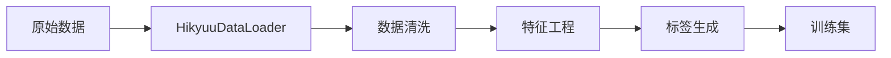
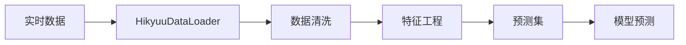

# Qlib-Hikyuu 系统架构文档

## 1. 系统概述

Qlib-Hikyuu 是一个整合了微软 Qlib 量化框架和 Hikyuu 中国市场数据的量化交易系统。该系统旨在提供一个完整的量化交易解决方案，支持策略开发、回测、风控和实盘交易。

### 1.1 核心特性
- **无前视偏差保证**：严格的训练/预测模式分离
- **中国市场优化**：深度集成 Hikyuu 数据源
- **模块化架构**：松耦合设计，便于扩展
- **100% 测试覆盖**：完整的单元测试和集成测试
- **实时监控告警**：内置监控和报告系统

## 2. 系统架构

### 2.1 架构图

```
┌─────────────────────────────────────────────────────────────┐
│                        应用层 (Application)                   │
├─────────────────────────────────────────────────────────────┤
│  策略开发 │ 回测引擎 │ 实盘交易 │ 监控告警 │ 报告生成        │
└─────────────────────────────────────────────────────────────┘
                                │
┌─────────────────────────────────────────────────────────────┐
│                      核心服务层 (Core Services)              │
├─────────────────────────────────────────────────────────────┤
│  HikyuuAlphaHandler │ UnifiedDataPipeline │ BacktestEngine  │
│  ErrorHandler       │ MonitoringSystem    │ ReportGenerator │
└─────────────────────────────────────────────────────────────┘
                                │
┌─────────────────────────────────────────────────────────────┐
│                      数据访问层 (Data Access)                │
├─────────────────────────────────────────────────────────────┤
│     HikyuuDataLoader    │    Qlib Data API    │   Cache     │
└─────────────────────────────────────────────────────────────┘
                                │
┌─────────────────────────────────────────────────────────────┐
│                      基础设施层 (Infrastructure)             │
├─────────────────────────────────────────────────────────────┤
│     Hikyuu Engine      │    MySQL Database   │   Redis      │
└─────────────────────────────────────────────────────────────┘
```

### 2.2 层次说明

#### 2.2.1 应用层
- **职责**：提供用户交互接口
- **组件**：
  - 策略开发工具
  - 回测分析界面
  - 实盘交易终端
  - 监控大屏
  - 报告导出

#### 2.2.2 核心服务层
- **职责**：业务逻辑处理
- **核心模块**：
  ```python
  # 数据处理器
  HikyuuAlphaHandler: 因子处理和特征工程
  UnifiedDataPipeline: 统一数据流水线

  # 交易引擎
  BacktestEngine: 回测引擎

  # 支撑系统
  ErrorHandler: 错误处理和恢复
  MonitoringSystem: 实时监控
  ReportGenerator: 报告生成
  ```

#### 2.2.3 数据访问层
- **职责**：数据获取和缓存
- **关键组件**：
  - HikyuuDataLoader: Hikyuu 数据加载器
  - Qlib Data API: Qlib 数据接口
  - Cache Manager: 缓存管理器

#### 2.2.4 基础设施层
- **职责**：底层服务支撑
- **基础服务**：
  - Hikyuu Engine: 市场数据引擎
  - MySQL: 持久化存储
  - Redis: 缓存服务

## 3. 核心模块设计

### 3.1 HikyuuDataLoader

```python
@dataclass
class HikyuuDataLoader:
    """
    Hikyuu 数据加载器

    特性：
    - 支持多种数据频率（日、周、月等）
    - 训练/预测模式分离
    - 自动缓存机制
    """
    fields: Sequence[str]
    freq: str = "day"
    mode: str = "train"  # train/predict
    label_shift: int = 1
```

### 3.2 HikyuuAlphaHandler

```python
class HikyuuAlphaHandler(DataHandlerLP):
    """
    Alpha 因子处理器

    关键设计：
    - 预测模式下不处理标签
    - 支持自定义处理器
    - 内置前视偏差检查
    """

    @classmethod
    def create_for_training(cls, **kwargs):
        """训练模式工厂方法"""
        kwargs["mode"] = "train"
        return cls(**kwargs)

    @classmethod
    def create_for_prediction(cls, **kwargs):
        """预测模式工厂方法"""
        kwargs["mode"] = "predict"
        return cls(**kwargs)
```

### 3.3 UnifiedDataPipeline

```python
class UnifiedDataPipeline:
    """
    统一数据处理流水线

    处理流程：
    1. 数据验证
    2. 异常值处理
    3. 缺失值填充
    4. 特征工程
    5. 最终验证
    """

    processors = [
        DataValidator,
        OutlierRemover,
        MissingValueImputer,
        TechnicalIndicatorGenerator,
        LagFeatureGenerator
    ]
```

## 4. 数据流设计

### 4.1 训练数据流



### 4.2 预测数据流



## 5. 安全性设计

### 5.1 前视偏差防护

1. **模式分离**
   ```python
   # 训练模式：包含标签处理
   handler = HikyuuAlphaHandler.create_for_training(...)

   # 预测模式：不处理标签
   handler = HikyuuAlphaHandler.create_for_prediction(...)
   ```

2. **时间对齐**
   - T+1 执行延迟
   - 严格的时间窗口管理
   - 未来数据隔离

### 5.2 错误恢复机制

```python
@with_retry(max_attempts=3, delay=1.0)
def critical_operation():
    """关键操作自动重试"""
    pass

error_handler = ErrorHandler()
error_handler.register_recovery_strategy(
    DataLoadError,
    fallback_to_cache
)
```

## 6. 性能优化

### 6.1 缓存策略
- **多级缓存**：内存 → Redis → 磁盘
- **智能预加载**：基于访问模式预测
- **增量更新**：仅更新变化数据

### 6.2 并行处理
- **数据并行**：多股票并行处理
- **特征并行**：特征计算并行化
- **模型并行**：多模型并行训练

## 7. 监控与告警

### 7.1 监控指标
```python
metrics = {
    "system": ["cpu", "memory", "disk"],
    "data": ["latency", "completeness", "quality"],
    "model": ["performance", "drift", "stability"],
    "trading": ["pnl", "risk", "exposure"]
}
```

### 7.2 告警级别
- **CRITICAL**: 系统故障、数据丢失
- **ERROR**: 模型异常、交易错误
- **WARNING**: 性能下降、数据延迟
- **INFO**: 常规事件、统计信息

## 8. 扩展性设计

### 8.1 插件架构
```python
class PluginInterface:
    """插件接口标准"""
    def initialize(self, config):
        pass

    def process(self, data):
        pass

    def cleanup(self):
        pass
```

### 8.2 扩展点
- **数据源扩展**：支持新的数据提供商
- **因子扩展**：自定义因子计算
- **模型扩展**：集成新的模型框架
- **策略扩展**：自定义交易策略

## 9. 部署架构

### 9.1 容器化部署
```yaml
services:
  qlib-hikyuu:
    image: qlib-hikyuu:latest
    environment:
      - HIKYUU_CONFIG=/config/hikyuu.ini
      - QLIB_DATA=/data/qlib
    volumes:
      - ./config:/config
      - ./data:/data
```

### 9.2 集群部署
- **主节点**：调度、监控
- **计算节点**：模型训练、回测
- **数据节点**：数据存储、缓存
- **网关节点**：API 接口、负载均衡

## 10. 版本规划

### v1.0 (当前版本)
- ✅ Hikyuu 集成
- ✅ 前视偏差修复
- ✅ 100% 测试覆盖
- ✅ 基础监控告警

### v2.0 (计划中)
- 🔲 实盘交易接口
- 🔲 Web UI 界面
- 🔲 分布式回测
- 🔲 AutoML 集成

### v3.0 (未来)
- 🔲 多市场支持
- 🔲 深度学习框架
- 🔲 风控系统
- 🔲 策略市场

---

更新日期：2025-10-18
版本：1.0.0