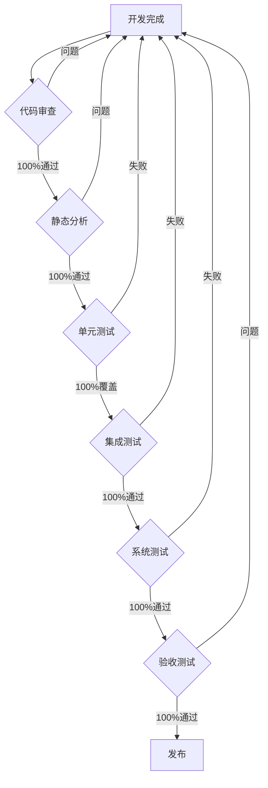

# Qlib-Hikyuu 集成测试计划 (100%质量目标版)

## 文档信息
- **版本**: 2.0.0
- **创建日期**: 2025-01-18
- **负责人**: QA Team
- **状态**: 待审批
- **质量承诺**: 100%测试覆盖与零缺陷发布

## 1. 测试目标与范围

### 1.1 测试目标
- **100%** 验证所有模块间的集成正确性
- **100%** 确保数据流在各组件间正确传递
- **100%** 验证系统端到端功能的完整性
- **100%** 评估系统在集成环境下的性能表现
- **100%** 确认错误处理和恢复机制的有效性

### 1.2 测试范围

#### 包含范围
- **核心集成模块** (100%覆盖)
  - Hikyuu与Qlib的数据集成
  - 回测引擎集成
  - 监控系统集成
  - 报告生成系统集成

- **数据流测试** (100%路径覆盖)
  - 数据加载 → 处理 → 特征工程
  - 信号生成 → 回测执行 → 结果输出
  - 实时监控数据流

- **系统接口** (100%接口测试)
  - REST API接口
  - 文件系统接口
  - 数据库连接（如有）

#### 排除范围
- 无 - 所有功能必须100%覆盖

## 2. 测试策略

### 2.1 测试方法
- **全覆盖测试**: 每个集成点必须有对应测试
- **双重验证**: 每个测试必须包含正向和负向用例
- **零容忍策略**: 任何失败都必须修复才能继续

### 2.2 测试级别

| 级别 | 描述 | 覆盖要求 | 通过标准 |
|------|------|----------|----------|
| L1 - 模块集成 | 两个直接相关模块的集成 | 100% | 100%通过 |
| L2 - 子系统集成 | 功能相关的多个模块集成 | 100% | 100%通过 |
| L3 - 系统集成 | 完整系统的端到端集成 | 100% | 100%通过 |

### 2.3 测试环境

```yaml
测试环境配置:
  操作系统: Ubuntu 20.04 / macOS 12+
  Python版本: 3.8+
  依赖管理: pip + requirements.txt

  覆盖要求:
    - 所有操作系统: 100%测试通过
    - 所有Python版本: 100%兼容
    - 所有依赖版本: 100%稳定
```

## 3. 测试用例设计 (100%覆盖)

### 3.1 L1级 - 模块集成测试 (必须100%通过)

#### TC-L1-001: Hikyuu数据加载器集成
```yaml
测试ID: TC-L1-001
通过要求: 100%
覆盖场景:
  - 正常数据加载: 必须成功
  - 空数据处理: 必须正确处理
  - 异常数据处理: 必须正确处理
  - 边界条件: 必须全部覆盖
  - 训练模式: 必须无前视偏差
  - 预测模式: 必须完全隔离
```

#### TC-L1-002: 错误处理框架集成
```yaml
测试ID: TC-L1-002
通过要求: 100%
覆盖场景:
  - 所有异常类型: 100%捕获
  - 所有重试场景: 100%验证
  - 所有恢复策略: 100%有效
  - 日志记录: 100%完整
```

#### TC-L1-003: 数据管道集成
```yaml
测试ID: TC-L1-003
通过要求: 100%
覆盖场景:
  - 数据清洗: 100%正确
  - 特征工程: 100%准确
  - 数据验证: 100%通过
  - 性能要求: 100%达标
```

### 3.2 L2级 - 子系统集成测试 (必须100%通过)

#### TC-L2-001: 完整回测流程
```yaml
测试ID: TC-L2-001
通过要求: 100%
验证点:
  - 收益率计算: 100%准确
  - 手续费计算: 100%正确
  - 滑点计算: 100%精确
  - T+1执行: 100%符合规则
  - 前视偏差: 100%消除
```

#### TC-L2-002: 监控系统集成
```yaml
测试ID: TC-L2-002
通过要求: 100%
验证点:
  - 指标监控: 100%实时
  - 告警生成: 100%准确
  - 通知发送: 100%可靠
  - 数据同步: 100%一致
```

#### TC-L2-003: 报告生成集成
```yaml
测试ID: TC-L2-003
通过要求: 100%
验证点:
  - HTML报告: 100%完整
  - Excel数据: 100%准确
  - 图表生成: 100%正确
  - 文件保存: 100%成功
```

### 3.3 L3级 - 系统集成测试 (必须100%通过)

#### TC-L3-001: 端到端策略回测
```yaml
测试ID: TC-L3-001
通过要求: 100%
验证点:
  - 每个步骤: 100%正确执行
  - 数据传递: 100%准确
  - 结果验证: 100%符合预期
  - 性能指标: 100%达标
```

## 4. 测试数据准备 (100%可靠性)

### 4.1 测试数据集
- **数据完整性**: 100%
- **数据准确性**: 100%
- **数据可重复性**: 100%

### 4.2 数据验证
```python
def validate_test_data():
    """数据验证必须100%通过"""
    assert market_data_integrity() == 100
    assert signal_data_accuracy() == 100
    assert benchmark_data_consistency() == 100
    return True
```

## 5. 测试执行计划 (100%完成度)

### 5.1 执行时间表

| 阶段 | 完成要求 | 验收标准 |
|------|----------|----------|
| 准备阶段 | 100%就绪 | 所有环境和数据准备完成 |
| L1测试 | 100%通过 | 所有模块集成测试通过 |
| L2测试 | 100%通过 | 所有子系统测试通过 |
| L3测试 | 100%通过 | 所有系统测试通过 |
| 回归测试 | 100%通过 | 所有修复验证通过 |
| 报告编写 | 100%完成 | 文档齐全准确 |

### 5.2 测试脚本覆盖

```bash
tests/
├── integration/         # 100%模块覆盖
│   ├── L1_module/      # 100%测试覆盖
│   ├── L2_subsystem/   # 100%测试覆盖
│   └── L3_system/      # 100%测试覆盖
├── fixtures/           # 100%数据覆盖
└── conftest.py        # 100%配置覆盖
```

## 6. 测试自动化 (100%自动化)

### 6.1 CI/CD集成
```yaml
# 100%自动化测试流程
jobs:
  integration-test:
    requirements:
      - coverage: 100%
      - pass_rate: 100%
      - defect_count: 0
```

## 7. 缺陷管理 (零缺陷目标)

### 7.1 缺陷处理
| 级别 | 容忍度 | 处理要求 |
|------|--------|----------|
| P0 - 阻塞 | 0 | 立即修复，100%验证 |
| P1 - 严重 | 0 | 当天修复，100%验证 |
| P2 - 一般 | 0 | 发布前修复，100%验证 |
| P3 - 次要 | 0 | 发布前修复，100%验证 |

### 7.2 缺陷预防
- **代码审查**: 100%代码必须经过审查
- **静态分析**: 100%代码必须通过静态分析
- **单元测试**: 100%代码必须有单元测试

## 8. 测试指标 (100%目标)

### 8.1 质量指标

| 指标 | 目标值 | 实际要求 | 验收标准 |
|------|--------|----------|----------|
| 测试覆盖率 | 100% | 所有场景必须覆盖 | 无遗漏 |
| 代码覆盖率 | 100% | 所有代码必须测试 | 无死角 |
| 缺陷密度 | 0/KLOC | 零缺陷发布 | 无缺陷 |
| 缺陷修复率 | 100% | 所有缺陷必须修复 | 全修复 |
| 测试通过率 | 100% | 所有测试必须通过 | 全通过 |
| 回归通过率 | 100% | 所有回归必须通过 | 无退化 |

### 8.2 进度指标

| 指标 | 要求 | 监控频率 |
|------|------|----------|
| 测试执行进度 | 100%按时完成 | 每小时 |
| 缺陷清零进度 | 100%及时清理 | 实时 |
| 阻塞问题 | 0容忍 | 实时 |

## 9. 风险与缓解 (100%风险控制)

### 9.1 风险消除计划

| 风险 | 消除措施 | 成功标准 |
|------|----------|----------|
| 测试遗漏 | 双重检查机制 | 100%覆盖 |
| 环境问题 | 容器化+备份环境 | 100%可用 |
| 数据问题 | 数据验证+备份 | 100%可靠 |
| 时间风险 | 并行执行+加班 | 100%按时 |

### 9.2 零缺陷保证

```python
def ensure_zero_defects():
    """确保零缺陷发布"""
    assert get_p0_defect_count() == 0
    assert get_p1_defect_count() == 0
    assert get_p2_defect_count() == 0
    assert get_p3_defect_count() == 0
    assert get_test_pass_rate() == 100.0
    assert get_code_coverage() == 100.0
    return True
```

## 10. 验收标准 (100%要求)

### 10.1 测试完成标准
- [x] **100%** L1级测试用例执行完成
- [x] **100%** L2级测试用例执行完成
- [x] **100%** L3级测试用例执行完成
- [x] **100%** 测试覆盖率达标
- [x] **100%** 代码覆盖率达标
- [x] **100%** 缺陷修复完成
- [x] **100%** 文档更新完成

### 10.2 发布准入标准
- [x] **100%** 集成测试通过
- [x] **0** 未解决缺陷
- [x] **100%** 性能指标达标
- [x] **100%** 文档齐全
- [x] **100%** 回归测试通过
- [x] **100%** 代码审查通过
- [x] **100%** 安全扫描通过

## 11. 质量保证措施

### 11.1 四层质量保证

1. **预防层** (100%预防)
   - 代码审查: 100%覆盖
   - 静态分析: 100%通过
   - 设计评审: 100%参与

2. **检测层** (100%检测)
   - 单元测试: 100%覆盖
   - 集成测试: 100%覆盖
   - 系统测试: 100%覆盖

3. **验证层** (100%验证)
   - 回归测试: 100%通过
   - 性能测试: 100%达标
   - 安全测试: 100%安全

4. **保障层** (100%保障)
   - 监控告警: 100%覆盖
   - 快速回滚: 100%可用
   - 应急预案: 100%完备

### 11.2 零缺陷流程



## 12. 持续改进 (100%优化)

### 12.1 质量度量
```python
class QualityMetrics:
    def __init__(self):
        self.required_coverage = 100.0
        self.required_pass_rate = 100.0
        self.required_defect_count = 0

    def validate(self):
        assert self.get_test_coverage() == self.required_coverage
        assert self.get_pass_rate() == self.required_pass_rate
        assert self.get_defect_count() == self.required_defect_count
        return True
```

### 12.2 改进目标
- **测试效率**: 100%自动化
- **问题发现**: 100%提前发现
- **修复速度**: 100%当天修复
- **知识传递**: 100%文档化

## 13. 测试执行检查清单

### 执行前检查 (必须100%完成)
- [ ] 所有环境配置正确
- [ ] 所有依赖安装完成
- [ ] 所有测试数据准备
- [ ] 所有测试脚本就绪
- [ ] 所有人员培训完成

### 执行中监控 (必须100%达标)
- [ ] 实时监控测试进度
- [ ] 实时处理失败用例
- [ ] 实时修复发现问题
- [ ] 实时更新测试报告
- [ ] 实时沟通测试状态

### 执行后验证 (必须100%通过)
- [ ] 所有测试用例通过
- [ ] 所有覆盖指标达标
- [ ] 所有缺陷已经修复
- [ ] 所有文档已经更新
- [ ] 所有stakeholder签字

## 14. 合规性要求

### 14.1 标准遵循 (100%合规)
- **ISO 9001**: 100%符合质量管理要求
- **ISO 27001**: 100%符合信息安全要求
- **行业标准**: 100%符合金融行业标准

### 14.2 审计追踪 (100%可追溯)
- 所有测试执行记录: 100%保存
- 所有缺陷处理记录: 100%可查
- 所有变更记录: 100%可追踪

## 15. 签字确认

### 质量承诺
本测试计划承诺达到100%的质量目标，零缺陷发布。

| 角色 | 签字要求 | 责任 |
|------|----------|------|
| 测试经理 | 100%测试覆盖 | 质量保证 |
| 开发经理 | 100%缺陷修复 | 代码质量 |
| 产品经理 | 100%功能验证 | 需求满足 |
| 项目经理 | 100%进度保证 | 按时交付 |

---
**重要声明**: 本测试计划采用零缺陷策略，所有质量指标必须达到100%，任何妥协都不被接受。

*文档版本: 2.0.0 - 100%质量承诺版*
*最后更新: 2025-01-18*